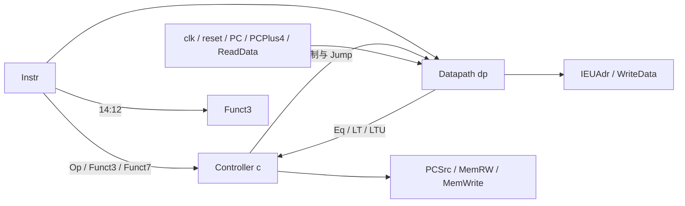

# 模块 07：IEU 整数执行单元核验报告（第七章第 8 轮）

## 1. 依据与本轮范围

依据本地《RISC-V System-on-Chip Design, Edition 1》第七章 §7.1、图 7.2 和表 7.1 的 RV32 列；执行结果与地址对应 §7.1.3、表 7.3，控制结构对应 §7.1.4、图 7.7/7.8 与表 7.6/7.7。CVW 参考 `/home/unlastingstar/cvw/src/ieu/ieu.sv`、`controller.sv`、`datapath.sv`，采用整数执行单元组合控制与数据通路、向 LSU 提供读写控制及功能字段的分层关系，不移植其流水线、CSR 或扩展接口。

上一轮 Datapath 已按用户指示提交为 `ffd13e5`，提交前 13 个套件、109 项回归全部通过。本轮只完善 **IEU**，对外导出 MemRW 与 Funct3，并验证已接通的整数执行能力。LSU 子字数据处理、顶层新观察端口、复位期间存储写入抑制等仍留待计划对应轮次；本轮不提前实施访存辅助模块。

| 交付内容 | 路径 |
| --- | --- |
| 模块与端口 | [IEU.scala](../../src/main/scala/riscvsingle/ieu/IEU.scala) |
| 生成入口 | [GenerateIEU.scala](../../src/main/scala/riscvsingle/GenerateIEU.scala) |
| 模块及程序测试 | [IEUSpec.scala](../../src/test/scala/riscvsingle/ieu/IEUSpec.scala) |
| 独立 RTL | [IEU.v](../../generated/ieu/IEU.v) |

## 2. 参数与全部端口

类 `riscvsingle.ieu.IEU` 继承 `RawModule`，构造参数 `config: CpuConfig = CpuConfig()` 传给 Datapath；显式提供 clk 与高有效同步 reset。指令固定 32 位，当前数据宽度为 32，寄存器堆固定 32 项。IEU 自身不新增状态，状态在 Datapath 的 RegFile 中。

| CpuConfig 字段 | 默认值 | 合法范围 | 在 IEU 中的用途 |
| --- | --- | --- | --- |
| xlen | 32 | 当前仅允许 32 | PC、地址、数据及 Datapath 位宽；不代表支持 RV64。 |
| imemDepth | 64 | 不小于 2 的二次幂，32 位字容量对应字节数不超过 2^32 | 参数保留，IEU 不生成 IROM。 |
| dmemDepth | 64 | 同上 | 参数保留，IEU 不生成数据 RAM。 |
| resetVector | 0 | 0 至 2^32−1，4 字节对齐 | 参数保留，PC 状态由外部提供。 |
| instructionInitFile | None | None 或非空白字符串 | 参数保留，不用于寄存器或存储初始化。 |

生成入口 GenerateIEU 使用默认 CpuConfig，仅接受可选输出目录 targetDir，默认 `generated/ieu`。不同有效配置可由 Scala 构造参数传入，本模块的数据宽度仍限定 RV32。

| Chisel 名称 | 实际 Verilog 端口 | 方向 | 类型 / 位宽 | 用途 |
| --- | --- | --- | --- | --- |
| clk | clk | 输入 | Clock / 1 | 传到 Datapath/RegFile，上升沿写入或同步复位。 |
| reset | reset | 输入 | Bool / 1 | 同步清零 x0，抑制正常寄存器写入，非零寄存器保持。 |
| io.Instr | io_Instr | 输入 | UInt / 32 | 当前指令的 opcode、功能字段、寄存器编号与立即数。 |
| io.PC | io_PC | 输入 | UInt / 32 | 当前指令字节地址，参与分支、JAL、AUIPC。 |
| io.PCPlus4 | io_PCPlus4 | 输入 | UInt / 32 | 外部提供的链接值，本模块不重新计算 PC+4。 |
| io.ReadData | io_ReadData | 输入 | UInt / 32 | 外部已经处理完成的加载数据，按原位模式写回。 |
| io.PCSrc | io_PCSrc | 输出 | Bool / 1 | 选择顺序地址或 IEUAdr，由外部 IFU 更新 PC。 |
| io.MemRW | io_MemRW | 输出 | UInt / 2 | 新增，{MemRead,MemWrite}；00 空闲、10 加载、01 存储。 |
| io.Funct3 | io_Funct3 | 输出 | UInt / 3 | 新增，恒为 Instr[14:12]，向 LSU 提供访问大小和符号类型。 |
| io.MemWrite | io_MemWrite | 输出 | Bool / 1 | 保留兼容观察/连接，恒为 MemRW[0]。 |
| io.IEUAdr | io_IEUAdr | 输出 | UInt / 32 | 加减地址；JALR 目标仅清除位 0。 |
| io.WriteData | io_WriteData | 输出 | UInt / 32 | 原始完整 R2，供外部存储。 |

共 **12 个端口：6 个输入、6 个输出**。Funct3 在非访存、非法指令及复位期间也直接转发，不作为访问有效标志；消费方应结合 MemRW。PCPlus4 与 ReadData 为外部输入，测试可故意提供不同值确认写回选择。X/Z 四态传播不作为接口保证。

## 3. 功能规则与连接

| 来源 | 接收位置 | 规则 |
| --- | --- | --- |
| Instr[6:0] | c.io.Op | opcode 译码。 |
| Instr[14:12] | Funct3、c.io.Funct3、dp.io.Funct3、io.Funct3 | 单一功能字段向控制、ALU 与外部 LSU 转发。 |
| Instr[31:25] | c.io.Funct7 | 完整功能字段合法性与 ALU 控制。 |
| dp.io.Eq/LT/LTU | c.io.Eq/LT/LTU | 原始 R1/R2 比较标志，不使用被选择的 PC/ImmExt。 |
| c 的 RegWrite/ALUSrc/ImmSrc/ALUControl/ALUResultSrc/ResultSrc/Jump | dp 对应输入 | 指令控制与写回选择。 |
| c.io.MemRW | MemRW、io.MemRW、io.MemWrite | 原样导出读写请求，兼容写使能取位 0。 |
| c.io.PCSrc | io.PCSrc | 六种条件分支或 JAL/JALR 改变下一 PC 选择。 |
| clk/reset、PC/PCPlus4、Instr、ReadData | dp 对应输入 | 外部状态和执行数据。 |
| dp.io.IEUAdr/WriteData | io.IEUAdr/WriteData | 地址与完整存储数据。 |



反馈不形成组合环路：比较来自寄存器读数，Controller 的 RegWrite 仅在上升沿改变寄存器状态。Controller/Datapath 的硬件算法沿用前轮实现，本轮不增加独立译码或运算电路。

| 指令类 | 执行行为 | MemRW |
| --- | --- | --- |
| 十种 R 型、九种 I 型 ALU | 按寄存器或立即数运算，写回 rd。 | 00 |
| LUI/AUIPC | LUI 写 ImmExt；AUIPC 写当前 PC+U 型立即数。 | 00 |
| 六种分支 | PC+B 型立即数为目标，Eq/LT/LTU 决定 PCSrc，寄存器保持。 | 00 |
| JAL/JALR | 写外部 PCPlus4；分别使用 PC+J 型立即数或 R1+I 型立即数的目标，JALR 只清位 0。 | 00 |
| LB/LH/LW/LBU/LHU | rs1+I 型立即数形成地址，外部 ReadData 在上升沿原样写回 rd。 | 10 |
| SB/SH/SW | rs1+S 型立即数形成地址，WriteData 恒为完整 rs2，寄存器保持。 | 01 |
| 非法 opcode/funct3/funct7 | Controller 关闭寄存器写入、读写请求与跳转；不实现异常/陷阱。 | 00 |

Funct3 的访存编码：加载 000/001/010/100/101 对应 LB/LH/LW/LBU/LHU；存储 000/001/010 对应 SB/SH/SW。IEU 不做字节提取、符号扩展或写数据复制，不检查数据地址自然对齐；这些属于后续 LSU。所有地址按 32 位回绕，JALR 目标位 1 保留，不实现指令地址未对齐异常。

寄存器时序保持完整 32 项直接索引约定：上升沿 reset=1 仅清零 x0、保留 x1–x31 并阻止正常写入；reset=0 时 RegWrite=1 且 rd≠0 才写入。无时钟沿的 reset 脉冲不改变状态。IEU 不保存 PC，也不拥有数据 RAM。

reset 不屏蔽组合控制输出：复位期间合法存储仍可输出 MemRW=01、MemWrite=1，Funct3 仍为指令字段。顶层复位期间禁止存储写入的计划项留待整机轮次；本轮保持已核验 IEU 约定。

## 4. 当前整机接通边界

IEU 独立实例的 MemRW 与 Funct3 可供测试环境或后续 LSU 消费。本轮保持 RiscvSingle、LSU 的生产接口与算法不变；当前整机仍通过兼容 MemWrite 连接旧的字 RAM。IEU 的新输出在整机导出时可能因尚未消费而被裁去，这属于生成层次优化，不能据此把独立 IEU 的接口范围或顶层观察接口混为一谈。

测试环境维护 PC 与指令映射，提供已经处理的 ReadData，并记录存储请求作为签名；这验证 IEU 的指令执行和请求交付。SB/SH 的字节保持、LB/LH 的提取与符号扩展、未对齐访问处理没有在 IEU 硬件中实现，仍按 SwByteMask、SubwordWrite、SubwordRead、DTIM、LSU 的后续轮次接入。整机完整指令签名验收留待最终轮次。

## 5. 内部信号与实际 RTL 名称

下表列出 IEU 中全部显式功能 Wire。它们均为组合连接，不引入新状态。别名允许由编译器折叠，表中实际名称以本轮独立 [IEU.v](../../generated/ieu/IEU.v) 为准。

| Chisel 名称 | 类型 / 位宽 | 定义 | 实际生成 RTL |
| --- | --- | --- | --- |
| RegWrite | Bool / 1 | Controller 寄存器写使能 | `dp_io_RegWrite=c_io_RegWrite` |
| Eq | Bool / 1 | 原始 R1/R2 相等 | `c_io_Eq=dp_io_Eq` |
| LT | Bool / 1 | 原始 R1/R2 有符号小于 | `c_io_LT=dp_io_LT` |
| LTU | Bool / 1 | 原始 R1/R2 无符号小于 | `c_io_LTU=dp_io_LTU` |
| ALUResultSrc | Bool / 1 | 选择 AltResult 或 ALUResult | `dp_io_ALUResultSrc=c_io_ALUResultSrc` |
| Jump | Bool / 1 | JAL/JALR 链接值选择 | `dp_io_Jump=c_io_Jump` |
| ResultSrc | Bool / 1 | 加载数据最终写回选择 | `dp_io_ResultSrc=c_io_ResultSrc` |
| ALUSrc | UInt / 2 | {SrcA 选 PC, SrcB 选立即数} | `dp_io_ALUSrc=c_io_ALUSrc` |
| ImmSrc | UInt / 3 | I/S/B/J/U 格式选择 | `dp_io_ImmSrc=c_io_ImmSrc` |
| ALUControl | UInt / 2 | {SubArith,ALUOp} | `dp_io_ALUControl=c_io_ALUControl` |
| MemRW | UInt / 2 | {MemRead,MemWrite} | `MemRW=c_io_MemRW`；`io_MemWrite=MemRW[0]` |
| Funct3 | UInt / 3 | Instr[14:12] | 别名折叠为 `io_Funct3`、`c_io_Funct3`、`dp_io_Funct3` 各自的指令切片赋值 |

两个直接子模块是 `c: Controller` 和 `dp: Datapath(config)`，后者含 RegFile、Extend、Cmp、ALU，ALU 内含 Shifter。独立 RTL 共八个模块定义；子模块连接线采用 `c_*`、`dp_*` 前缀，其方向和位宽对应端口。clk/reset 直接接入 dp，IEU 不增加寄存器、PC 或存储器。

独立 IEU 保留全部 12 个端口；两份 CPU 导出中的 IEU 仍只有原来的 10 个端口，未消费的 `io_MemRW`、`io_Funct3` 被裁去。内部 `c_io_MemRW` 和 `MemRW` 保留，因为兼容 `io_MemWrite` 使用其位 0。三份依赖 RTL 中未使用的 Controller `io_MemWrite` 输出被裁去，独立 Controller 导出仍保留前轮完整接口。没有使用 dontTouch 强制保留别名，也不把编译器临时名称作为稳定接口。

## 6. 测试先行与模块验证

首先只把现有生成接口断言从 10 个端口改为 12 个，再实际运行：

```bash
./scripts/sbt-local.sh 'testOnly riscvsingle.ieu.IEUSpec'
```

红阶段 **7 项中 6 通过、1 失败，退出码 1**。失败为缺少 MemRW/Funct3 的接口映射断言，日志 `target/ieu-round8-red.log`；不是编译失败。之后添加功能测试，再实现 IEU 输出和内部连接。

绿色验证使用同一命令，**11 项全部通过，退出码 0**；日志 `target/ieu-round8-focused.log`。

| 验证内容 | 实际覆盖 |
| --- | --- |
| 访存请求和外部加载值 | 五种加载 × 正负偏移 × rd=x0/非零，共 20 组；三种存储 × 正负偏移，共 6 组。检查 MemRW、兼容 MemWrite、原始 Funct3、地址及完整 R2。加载原样写回外部 32 位数据，包含高符号位；SB/SH 不截断 WriteData。 |
| 非法指令 | 32 组非法加载/存储/分支功能字段、R 型 Funct7、立即数移位编码、JALR Funct3、RV64 字运算、FENCE、SYSTEM 与未知 opcode；检查无读写请求、无跳转、已初始化寄存器保持，Funct3 仍转发。 |
| 同步复位 | 加载、存储、普通 ALU、JALR、LUI 五类在 reset=1 的上升沿保持非零寄存器；组合请求/跳转不被 reset 门控。既有测试继续检查无边沿 reset 脉冲、x0 写保护及写入边沿。 |
| 完整程序 | 142 个指令字，按实际 PCSrc/IEUAdr 取指，执行 135 条后到达 PC=568。覆盖全部 37 类 RV32 指令、六种分支各 taken/untaken、正负 JAL、奇数 JALR、rs1=rd、rd=x0、负偏移、移位量截取、符号边界与 AUIPC 当前 PC；独立常量核对 25 个字存储签名。 |
| 混合参考模型 | 固定种子 0x1e008，564 条指令：37 类合法指令及 10 类非法编码各调度 12 次。每步核对全部六个输出、沿前/沿后寄存器结果和 x0；含随机寄存器别名、立即数、外部加载值、独立外部链接值及同步复位。 |
| 既有联调和结构 | 保留原有算术、比较分支、LUI/AUIPC/JALR 接线和第二章 Code Example 2.16 回归；后者仍在地址 96 写 7、地址 100 写 25。核对 12 个端口的方向/位宽及八个模块的层次。 |

参考模型用独立 BigInt 架构运算和指令字段计算，不复用 Controller 的 packed controls。运算结果与公开加减器地址分别建模：例如 SRAI 只用低 5 位移位量得到寄存器结果，地址仍由完整扩展操作数相减得到。JALR 参考目标用除二再乘二清位；包括非法 JALR opcode 的确定地址约定，但非法控制仍关闭执行副作用。

所有非零寄存器在观察前均由真实指令初始化；固定程序的外部加载必须先有已建立的字存储，混合序列也在提供外部加载返回值前建立对应地址值。固定程序最后的 SB/SH 只记录请求，不模拟本轮尚未实现的字节写入。测试范围是 IEU 与外部已完成加载的数据接口，不将返回值传递测试解释为 LSU 的符号扩展验证。

全工程回归实际运行：

```bash
./scripts/sbt-local.sh test
```

**13 个套件、113 项测试全部通过，退出码 0**，无失败或中止；既有模块、参数配置、原书程序及扩容程序回归保持通过。日志 `target/ieu-round8-regression.log`。

按用户本次提交指示再次执行同一全工程命令，仍为 **13 个套件、113 项全部通过，退出码 0**；提交前日志 `target/ieu-round8-precommit.log`。

## 7. RTL 生成与整机验证

实际生成命令：

```bash
./scripts/sbt-local.sh \
  'runMain riscvsingle.GenerateIEU generated/ieu' \
  'runMain riscvsingle.GenerateRiscvSingle 64 64 generated/riscv-single programs/riscvtest.memfile 0' \
  'runMain riscvsingle.GenerateRiscvSingle 128 128 generated/riscv-single128 programs/rv32-configtest.memfile 0x100'
make test-rtl
```

三个生成入口全部成功，退出码 0，日志 `target/ieu-round8-generate.log`；生成文件如下：

| 配置 | RTL 路径 |
| --- | --- |
| 独立 IEU | [generated/ieu/IEU.v](../../generated/ieu/IEU.v) |
| 默认 64 项 CPU、复位地址 0 | [generated/riscv-single/RiscvSingle.v](../../generated/riscv-single/RiscvSingle.v) |
| 128 项 CPU、复位地址 0x100 | [generated/riscv-single128/RiscvSingle.v](../../generated/riscv-single128/RiscvSingle.v) |

已核对独立 IEU 的 12 个端口、新控制字段赋值、三路比较反馈、Jump/ImmSrc/ALUControl 与 Datapath 连接，及 CPU 导出对未消费输出的裁剪。RiscvSingle 与 LSU 的生产接口仍各为五个端口，本轮没有修改其硬件源码。

`make test-rtl` 使用 Verilator 5.036 直接编译重新生成的默认和扩容 CPU。book/expanded 配置各运行随机初值种子 1、17、2026，**六次全部 PASS，退出码 0**：book 每次执行 19 周期、2 次存储，expanded 每次执行 13 周期、5 次存储，均检查结束循环及同步复位。日志 `target/ieu-round8-rtl.log`。

本次提交前再次运行 `make test-rtl`，同样六次全部 PASS、退出码 0；日志 `target/ieu-round8-precommit-rtl.log`。

本轮 RTL 整机回归验证已有合法程序和接口兼容；全部 37 类指令由独立 IEU 定向程序及参考模型验证。完整 RV32 子字整机程序与字节保持检查仍待后续 LSU 和顶层轮次，不能将此处的外部加载返回值测试理解为已完成整机全部访存能力。

## 8. 核验停点

**本轮停止，等待用户核验。** IEU 源码、测试、三份生成 RTL 和报告已交付。用户随后要求生成可供后续执行的进度报告并提交当前进度，本轮成果与 [第七章进度报告](../chapter7-progress.md) 一同纳入提交。提交后保持第 8 轮停点，尚未开始第 9 轮 SwByteMask；收到后续执行指示后再继续，不自动连续实施其他模块。
