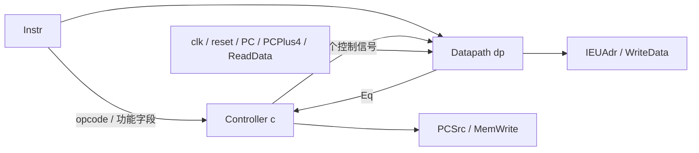

# 模块 07：IEU 整数执行单元核验报告

## 1. 依据与交付状态

对应《RISC-V System-on-Chip Design, Edition 1》Code Example 2.15 中的 `ieu`，书中第 62 页。本模块将 Controller 和 Datapath 组合成整数执行单元，对外提供跳转选择、内存写使能、访问/跳转地址及存储数据。

上一模块 Datapath 已按用户指示提交，提交号为 `b77a5cd`。本轮交付 **IEU 一个硬件模块**及其生成入口、测试和报告。

状态：**IEU 测试通过，尚未提交，等待用户核验。**

| 交付内容 | 路径 |
| --- | --- |
| 模块及端口定义 | [IEU.scala](../../src/main/scala/riscvsingle/ieu/IEU.scala) |
| Verilog 生成入口 | [GenerateIEU.scala](../../src/main/scala/riscvsingle/GenerateIEU.scala) |
| 模块测试 | [IEUSpec.scala](../../src/test/scala/riscvsingle/ieu/IEUSpec.scala) |
| 生成的硬件，含已有子模块 | [IEU.v](../../generated/ieu/IEU.v) |

## 2. 接口与参数配置

模块类为 `riscvsingle.ieu.IEU`，继承 `RawModule`，端口 Bundle 为 `IEUIO`。显式声明 `clk`、`reset`，其余端口具有 `io_` 前缀。共有 6 个输入和 4 个输出。

构造参数为 `config: CpuConfig = CpuConfig()`，同一配置对象传入 Datapath。PC、地址与数据端口宽度采用 `config.xlen`；当前配置要求 `xlen=32`，指令宽度固定为 32 位，Datapath 使用完整的 32 项寄存器。

`imemDepth`、`dmemDepth`、`resetVector`、`instructionInitFile` 在 IEU 中不参与硬件生成，留给后续存储器和取指模块使用。本轮未修改 `CpuConfig`，也未增加 RV64 或完整 RV32I 支持。

| Chisel 端口 | Verilog 端口 | 方向 | 类型 / 位宽 | 功能 |
| --- | --- | --- | --- | --- |
| `clk` | `clk` | 输入 | `Clock` / 1 | 经 Datapath 传至 RegFile，上升沿执行寄存器写入或同步复位。 |
| `reset` | `reset` | 输入 | `Bool` / 1 | 高有效同步复位，经 Datapath 传至 RegFile，只清零 x0 并抑制普通寄存器写入。 |
| `io.Instr` | `io_Instr` | 输入 | `UInt(32.W)` | 当前指令；提供 opcode、功能码、寄存器编号及立即数。 |
| `io.PC` | `io_PC` | 输入 | `UInt(32.W)` | 当前指令字节地址，供 Datapath 计算分支或跳转目标。 |
| `io.PCPlus4` | `io_PCPlus4` | 输入 | `UInt(32.W)` | 外部提供的顺序地址，供 jal 写入链接寄存器。 |
| `io.PCSrc` | `io_PCSrc` | 输出 | `Bool` / 1 | 0 选择 PCPlus4，1 选择 IEUAdr，交给后续 IFU 更新 PC。 |
| `io.MemWrite` | `io_MemWrite` | 输出 | `Bool` / 1 | Controller 的存储写使能，交给后续 LSU。 |
| `io.IEUAdr` | `io_IEUAdr` | 输出 | `UInt(32.W)` | Datapath 的加减法结果，供内存访问或 PC 目标选择。 |
| `io.WriteData` | `io_WriteData` | 输出 | `UInt(32.W)` | Datapath 的第二个寄存器读数 R2，供 LSU 写入存储器。 |
| `io.ReadData` | `io_ReadData` | 输入 | `UInt(32.W)` | 外部内存读数据，供 lw 写回寄存器。 |

## 3. 功能与模块连接

IEU 直接从 Instr 提取指令字段，连接关系如下：

| 指令字段 / 信号 | 接收位置 | 用途 |
| --- | --- | --- |
| Instr[6:0] | `c.io.Op` | Controller 主译码。 |
| Instr[14:12] | `c.io.Funct3`、`dp.io.Funct3` | 同时驱动控制生成及 ALU 功能选择。 |
| Instr[30] | `c.io.Funct7b5` | R 型减法选择；addi 不因负立即数而改为减法。 |
| `dp.io.Eq` | `c.io.Eq` | 根据原始寄存器读数决定 beq 是否跳转。 |
| Controller 六个内部控制输出 | Datapath 对应输入 | 选择立即数、操作数、ALU 功能和寄存器写回路径。 |
| clk/reset、PC/PCPlus4、Instr、ReadData | Datapath 对应输入 | 时钟复位及执行所需外部数据。 |
| `c.io.PCSrc/MemWrite` | IEU 对应输出 | 跳转选择及内存写使能。 |
| `dp.io.IEUAdr/WriteData` | IEU 对应输出 | 地址与存储数据。 |



Eq 来源于寄存器组合读数，控制器的 RegWrite 仅在上升沿影响寄存器状态，因此上述反馈不会形成组合逻辑环路。IEU 自身新增的是连接线；状态仍位于 Datapath 的 RegFile 中。

| 指令组 | 执行行为 |
| --- | --- |
| R 型 ALU / I 型 ALU | 从寄存器或立即数取操作数，按既有 ALU 功能运算，在上升沿写回 rd；PCSrc、MemWrite 均为 0。 |
| lw | IEUAdr 为 rs1 加 I 型立即数；ReadData 在上升沿写回 rd。 |
| sw | IEUAdr 为 rs1 加 S 型立即数；WriteData 为 rs2，MemWrite=1；寄存器保持。 |
| beq | IEUAdr 为 PC 加 B 型立即数；PCSrc 由 rs1、rs2 相等标志决定；寄存器保持。 |
| jal | IEUAdr 为 PC 加 J 型立即数；PCSrc=1；外部 PCPlus4 在上升沿写回 rd。 |
| 未实现 opcode | 沿用 Controller 全零控制字，关闭寄存器写入、内存写入与跳转选择；地址输出仍是组合运算值。 |

ALU 功能支持加减、有符号小于、或、与，未实现功能码的 ALUResult 为零。IEU 继承书中的 opcode 分组译码；已识别 opcode 内没有完整指令合法性检查，不能据此视为支持全部 RV32I 指令或非法指令异常。

PC、PCPlus4 和 ReadData 由外部提供。IEU 不保存 PC，也不实例化指令或数据存储器。本轮的程序联调通过 Scala 模型提供这些外部状态。

## 4. 内部信号名称

以下七个信号在 Chisel 中均显式定义为 Wire，沿用书中的有效连接名称。本次 Verilog 生成将这些别名合并为子模块端口连接线，因此报告同时列出对应的硬件名称。

| Chisel 内部信号 | 类型 / 位宽 | 功能 | 当前 Verilog 对应连接 |
| --- | --- | --- | --- |
| `RegWrite` | `Bool` / 1 | Controller 至 Datapath 的寄存器写使能。 | `c_io_RegWrite` → `dp_io_RegWrite`。 |
| `Eq` | `Bool` / 1 | Datapath 至 Controller 的寄存器相等标志。 | `dp_io_Eq` → `c_io_Eq`。 |
| `ALUResultSrc` | `Bool` / 1 | 选择 ALUResult 或 PCPlus4。 | `c_io_ALUResultSrc` → `dp_io_ALUResultSrc`。 |
| `ResultSrc` | `Bool` / 1 | 选择执行结果或内存 ReadData 写回。 | `c_io_ResultSrc` → `dp_io_ResultSrc`。 |
| `ALUSrc` | `UInt(2.W)` / 2 | 选择 ALU 两个操作数。 | `c_io_ALUSrc` → `dp_io_ALUSrc`。 |
| `ImmSrc` | `UInt(2.W)` / 2 | 选择 I/S/B/J 立即数格式。 | `c_io_ImmSrc` → `dp_io_ImmSrc`。 |
| `ALUControl` | `UInt(2.W)` / 2 | `{Sub, ALUOp}` 运算控制。 | `c_io_ALUControl` → `dp_io_ALUControl`。 |

书中 IEU 还声明了一个未使用的 `Jump`，本模块省略该无效连接线。有效的 Jump 仍是 Controller 的内部译码信号，参与其 PCSrc 计算。

| 子模块实例名 | 类型 | 功能 |
| --- | --- | --- |
| `c` | `Controller` | 指令译码与分支/跳转控制。 |
| `dp` | `Datapath(config)` | 寄存器读取、立即数扩展、运算、地址与数据输出、同步写回。 |

生成的 IEU 顶层还包含 `c_io_Op/Eq/Funct3/Funct7b5/ALUResultSrc/ResultSrc/MemWrite/PCSrc/RegWrite/ALUSrc/ImmSrc/ALUControl`，以及 `dp_clk`、`dp_reset`、`dp_io_Funct3/ALUResultSrc/ResultSrc/ALUSrc/RegWrite/ImmSrc/ALUControl/Eq/PC/PCPlus4/Instr/IEUAdr/WriteData/ReadData`。这些名称均为子模块连接线，位宽与对应端口一致；未使用 `dontTouch` 强制保留别名。

层次为 `IEU → c: Controller、dp: Datapath → rf: RegFile、ext: Extend、cmp: Cmp、alu: ALU`。生成文件共包含这七个模块的定义。

## 5. 时序、复位与原书差异

所有指令译码、分支判断、地址和数据输出都是组合逻辑。RegFile 在 clk 上升沿写入，写入后读输出随状态更新。

沿用用户已核验的完整 32 项寄存器和直接编号索引。高有效同步 reset 的优先级高于普通寄存器写入，只将 x0 清零，x1–x31 保持；正常写入排除 rd=0。x0 在首次 reset=1 的 clk 上升沿后保持零，其他寄存器没有初始值或复位值保证。

reset 直接传入 Datapath，**不会屏蔽 Controller 的 PCSrc 或 MemWrite 输出**。例如 reset=1 时输入 sw，MemWrite 仍为 1；IEU 的复位只约束内部寄存器更新，外部 PC 和存储器如何响应复位由后续模块定义。

与原书相比，本轮新增统一配置入口，其他端口增加 `io_` 前缀，省略未使用的 Jump 声明。Controller 的未实现 opcode 输出全零控制字，以及 RegFile 的 x0 专用同步复位，均来自已核验模块，本轮保持其行为。

## 6. 验证结果

验证日期：2026-10-03。工具链为 JDK 17、sbt 1.10.7、Scala 2.13.14、Chisel 3.6.1、chiseltest 0.6.2；功能仿真使用 Treadle 后端。

```bash
./scripts/sbt-local.sh test 'runMain riscvsingle.GenerateIEU'
```

**实际结果：IEU 新增 5 项测试全部通过；全项目 8 个套件、51 项测试全部通过。IEU Verilog 已生成。**

| 验证内容 | 实际覆盖 |
| --- | --- |
| 指令字段、运算及访存 | 初始化后执行负 addi、add、sub、or、and、slt、slti、ori、andi；检查写回值与独立地址输出，包括 SLT 溢出边界。lw 写回 `0x80000000`，sw 使用负偏移并保持寄存器。 |
| 分支反馈及 jal | beq 相等/不等、正/负偏移；检查目标地址和分支不修改寄存器；jal 使用特意不同于 PC+4 的外部 PCPlus4 值 `0xABC` 验证实际写回连接，另检查 jal x0。 |
| 时序、复位及未实现 opcode | 指令变化在时钟前不写入；reset 阻止对 x5 的更新且保留其内容；reset 下 sw 的 MemWrite 保持组合译码；addi/lw 向 x0 写入无效；四种未实现 opcode 禁止写入及跳转，x5 内容保持。 |
| 书中程序 | 通过生产 IEU 的公开接口执行 Code Example 2.16；检查 19 条实际执行指令的 PC 顺序及每条的 PCSrc/MemWrite。地址 96 写入 7，地址 100 写入 25，最终 PC 为 0x50；另检查 x2=25、x3=0x44、x9=18。 |
| 接口与层次 | 检查全部 10 个顶层端口及位宽、两个直接子模块实例名，以及七个模块定义的集合。 |

复位测试还使用 `CpuConfig(imemDepth=128, dmemDepth=256, resetVector=0x100)` 实例化 IEU，验证后续结构配置可以经构造参数传入。IEU 不负责按 resetVector 初始化 PC。

`IEUHarness` 仅为 chiseltest 提供 Module 测试顶层，内部直接实例化生产 IEU。程序测试的 PC 与内存由 Scala 模型维护，因此结果验证本轮 IEU 执行行为；完整 CPU 硬件、FPGA 实现和时序分析仍待后续工作。ChiselStage 弃用提示与此前一致，本轮未变更工具链。

单独生成可执行 `make generate-ieu SBT=./scripts/sbt-local.sh`，输出目录由 `IEU_TARGET_DIR` 指定。`GenerateIEU` 仅接受一个可选的输出目录参数，默认 `generated/ieu`；硬件参数通过 Scala 的 CpuConfig 构造入口传入。

## 7. 核验停点

本轮到此停止，IEU 及配套资料保留在工作区等待核验。收到修改意见时，仅修改当前模块及配套资料并重新验证；核验通过并允许继续后，下一模块为 IROM。
