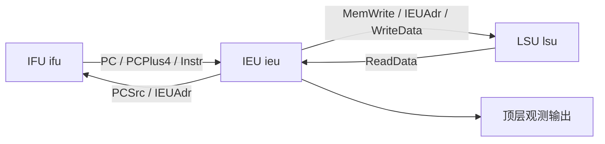

# 模块 11：RiscvSingle 单周期 CPU 顶层核验报告

## 1. 依据与交付状态

对应《RISC-V System-on-Chip Design, Edition 1》Code Example 2.15 的 `riscvsingle`，书中第 61 页。顶层将 IFU、IEU、LSU 接成完整单周期执行链路，内部完成取指、指令执行、数据读写和下一 PC 选择。

上一模块 LSU 已按用户指示提交，提交号为 `b882f2d`。本轮交付 **RiscvSingle 一个硬件模块**及其生成入口、整机测试、配置测试镜像和报告。预定的 11 个硬件模块均已实现。

状态：**RiscvSingle 测试通过，尚未提交，等待用户核验。**

| 交付内容 | 路径 |
| --- | --- |
| 模块及端口定义 | [RiscvSingle.scala](../../src/main/scala/riscvsingle/RiscvSingle.scala) |
| 生成入口 | [GenerateRiscvSingle.scala](../../src/main/scala/riscvsingle/GenerateRiscvSingle.scala) |
| 整机测试 | [RiscvSingleSpec.scala](../../src/test/scala/riscvsingle/RiscvSingleSpec.scala) |
| 默认配置完整硬件 | [RiscvSingle.v](../../generated/riscv-single/RiscvSingle.v) |
| 128 项、复位地址 0x100 的完整硬件 | [RiscvSingle.v](../../generated/riscv-single128/RiscvSingle.v) |
| 书中程序镜像 | [riscvtest.memfile](../../programs/riscvtest.memfile) |
| 配置测试程序镜像 | [rv32-configtest.memfile](../../programs/rv32-configtest.memfile) |

## 2. 顶层端口

模块类为 `riscvsingle.RiscvSingle`，继承 `RawModule`，Bundle 为 `RiscvSingleIO`。保留原书的 2 个输入和 3 个输出，显式声明 clk/reset，观测输出具有 `io_` 前缀。

| Chisel 端口 | Verilog 端口 | 方向 | 类型 / 位宽 | 功能 |
| --- | --- | --- | --- | --- |
| `clk` | `clk` | 输入 | `Clock` / 1 | 三个直接子模块共用时钟，状态在上升沿更新。 |
| `reset` | `reset` | 输入 | `Bool` / 1 | 高有效同步复位，接入 IFU 和 IEU；在上升沿复位 PC 和 x0。 |
| `io.WriteData` | `io_WriteData` | 输出 | `UInt(config.xlen.W)` / 32 | IEU 的第二个寄存器读数，同时作为内部 LSU 写数据。 |
| `io.IEUAdr` | `io_IEUAdr` | 输出 | `UInt(config.xlen.W)` / 32 | IEU 地址运算结果，同时驱动内部 LSU 地址和 IFU 跳转目标。 |
| `io.MemWrite` | `io_MemWrite` | 输出 | `Bool` / 1 | IEU 的存储写使能，同时驱动内部 LSU。为 1 时，下一上升沿写入该地址的数据字。 |

这三个输出用于观测执行与存储事务。MemWrite=0 时，IEUAdr 和 WriteData 仍有组合值，不能据此认定发生了存储操作。顶层没有外部 ReadData、PC 输入或总线握手，程序与数据存储器均在内部。

## 3. 配置与生成入口

构造参数为 `config: CpuConfig = CpuConfig()`。同一个配置对象传给 IFU、IEU、LSU，各字段在子模块中消费；本轮未修改配置类。

| 配置项 | 默认值 | 功能 |
| --- | --- | --- |
| `xlen` | 32 | 地址和数据位宽，当前限定 RV32，32 位指令和 32 项寄存器。 |
| `imemDepth` | 64 | IROM 的指令字数量，至少 2 的二次幂。 |
| `dmemDepth` | 64 | LSU RAM 的数据字数量，至少 2 的二次幂。 |
| `resetVector` | 0 | IFU 同步复位加载的字节地址，要求 4 字节对齐且处于 XLEN 范围。 |
| `instructionInitFile` | None | IROM 仿真初始化文件；None 不初始化指令内容。 |

默认构造不加载程序；生成入口默认显式加载书中程序。五个可选参数依次为 `imemDepth`、`dmemDepth`、`targetDir`、`instructionInitFile`、`resetVector`，默认 `64`、`64`、`generated/riscv-single`、`programs/riscvtest.memfile`、`0`。文件参数 `-` 表示 None，复位地址支持十进制和 `0x`/`0X` 十六进制。

```bash
make generate-cpu SBT=./scripts/sbt-local.sh
make generate-cpu SBT=./scripts/sbt-local.sh \
  IMEM_DEPTH=128 DMEM_DEPTH=128 CPU_TARGET_DIR=generated/riscv-single128 \
  INSTRUCTION_INIT_FILE=programs/rv32-configtest.memfile RESET_VECTOR=0x100
```

## 4. 功能与模块连接

IFU 根据当前 PC 读取内部 IROM，向 IEU 提供 PC、PCPlus4 和 Instr。IEU 译码并读取寄存器，生成运算结果、地址、写数据及控制信号。LSU 将 ReadData 返回 IEU，供 lw 写回。IEU 的 PCSrc 与 IEUAdr 返回 IFU，控制下一 PC。



正常执行时，组合路径在当前周期完成取指、寄存器读取、运算与内存读取；上升沿更新 PC、目标寄存器或 RAM。顶层自身不新增状态、暂停或额外执行逻辑。

已实现书中的简化 RV32 子集：add/sub/slt/or/and、对应支持功能的 I 型运算、lw、sw、beq、jal。Controller 仍按 opcode 分组译码，没有完整 RV32I 指令合法性检查；未实现 opcode 输出全零控制，已识别 opcode 内的未实现功能码不会自动关闭 RegWrite。本轮未加入异常、CSR、中断、压缩指令或外部总线协议。

## 5. 内部信号名称与层次

五个内部信号均在 Chisel 中显式定义为 Wire，名称与书中顶层一致。当前生成器将其别名合并为子模块端口连接线。

| 内部信号 | 类型 / 位宽 | 功能 | 当前 Verilog 对应连接 |
| --- | --- | --- | --- |
| `PC` | `UInt(config.xlen.W)` / 32 | 当前指令字节地址。 | `ifu_io_PC` → `ieu_io_PC`。 |
| `PCPlus4` | `UInt(config.xlen.W)` / 32 | 顺序地址，供 jal 链接写回。 | `ifu_io_PCPlus4` → `ieu_io_PCPlus4`。 |
| `Instr` | `UInt(32.W)` | 当前指令。 | `ifu_io_Instr` → `ieu_io_Instr`。 |
| `ReadData` | `UInt(config.xlen.W)` / 32 | LSU 的组合读数据。 | `lsu_io_ReadData` → `ieu_io_ReadData`。 |
| `PCSrc` | `Bool` / 1 | IEU 生成的下一 PC 选择。 | `ieu_io_PCSrc` → `ifu_io_PCSrc`。 |

| 直接子模块实例名 | 类型 | 功能 |
| --- | --- | --- |
| `ifu` | `IFU(config)` | PC 状态、顺序地址、目标选择与 IROM 取指。 |
| `ieu` | `IEU(config)` | 控制器与数据通路，完成指令执行。 |
| `lsu` | `LSU(config)` | 组合读、上升沿写的数据 RAM。 |

自动连接线包括 `ifu_clk/reset`、`ifu_io_PCSrc/IEUAdr/Instr/PC/PCPlus4`，`ieu_clk/reset`、`ieu_io_Instr/PC/PCPlus4/PCSrc/MemWrite/IEUAdr/WriteData/ReadData`，`lsu_clk`、`lsu_io_MemWrite/IEUAdr/WriteData/ReadData`。位宽与相应子模块端口一致，未使用 dontTouch 强制保留别名。

完整层次为：

```text
RiscvSingle
├── ifu: IFU
│   └── irom: IROM
├── ieu: IEU
│   ├── c: Controller
│   └── dp: Datapath
│       ├── rf: RegFile
│       ├── ext: Extend
│       ├── cmp: Cmp
│       └── alu: ALU
└── lsu: LSU
```

每个生成的完整 CPU 文件包含这 11 个模块定义，作为一套完整层次使用。无需同时编译各模块独立生成目录中的重复定义。

## 6. 同步复位、存储器与实现边界

按已核验要求，所有复位均为高有效同步复位。在 reset=1 的 clk 上升沿，IFU 的 PC 加载 resetVector，RegFile 的 x0 清零并阻止普通寄存器写入；x1–x31 保持。reset 电平变化及未跨越上升沿的短脉冲不会更新状态。

LSU 没有复位端口，顶层沿用直接 MemWrite 连接，没有增加复位屏蔽：RAM 不清空，MemWrite=1 时的上升沿仍写入。上层复位期间的组合控制输出也未屏蔽。首次有效复位前的 PC/x0、非零寄存器的初值及未写入 RAM 内容均没有已知值保证。

两类存储器均忽略字内低两位和索引以上高位，按容量回绕，未增加地址范围或对齐异常。IROM 初始化文件的相对路径以仿真运行目录为基准，未覆盖条目或 None 配置内容未指定。当前生成的 `$readmemh` 位于 `ifndef SYNTHESIS` 块内，程序加载已经过仿真验证；FPGA/ASIC 程序固化、实现与时序分析尚未完成。

## 7. 验证结果

验证日期：2026-10-04。工具链为 JDK 17、sbt 1.10.7、Scala 2.13.14、Chisel 3.6.1、chiseltest 0.6.2；功能仿真采用 Treadle 后端。

```bash
./scripts/sbt-local.sh test \
  'runMain riscvsingle.GenerateRiscvSingle' \
  'runMain riscvsingle.GenerateRiscvSingle 128 128 generated/riscv-single128 programs/rv32-configtest.memfile 0x100'
```

**实际结果：RiscvSingle 新增 4 项测试全部通过；全项目 12 个套件、74 项测试全部通过。默认及 128 项配置的完整 CPU Verilog 均已生成。**

| 验证内容 | 实际覆盖 |
| --- | --- |
| 书中程序、生产顶层接口 | 对 19 条实际执行指令逐周期检查 IEUAdr 和 MemWrite；仅两次存储，地址 96 写入 7、地址 100 写入 25；之后五个周期确认循环地址为 0x50、无写入、x2 读数为 25。 |
| 非零复位与容量传递 | 从 resetVector=0x100 执行完整 128 项测试镜像；指令与数据容量均为 128 项。检查字 127 与字 63 独立、未对齐存储/负偏移加载、jal 链接及跳过指令。 |
| 整机同步复位与 RAM 保持 | 程序先建立 RAM 地址 96 的值为 9；检查 reset 无上升沿时仍在循环、短脉冲无效，上升沿重启到首条加载，保持期间不推进；释放后加载并向地址 100 写出 9，验证实际 RAM 未被清空。最初未初始化加载的数值不作断言。 |
| 接口、结构与配置 | 默认、128 项配置和 None 初始化三种 elaboration，检查全部 5 个端口、11 个模块定义、三个直接实例名、ROM/RAM 深度及复位常量。PC、寄存器和 RAM 的三个状态更新块均仅由 posedge clk 触发。 |

128 项镜像在字索引 64（字节地址 0x100）放置 14 条测试指令，其余条目填充 NOP。实际执行 13 条，跳过一次 addi，最终在 0x134 循环。已检查的存储事务为：

| 地址 | 数据 | 验证目的 |
| --- | --- | --- |
| 511 | 31 | 写入字 127，低两位忽略。 |
| 252 | 7 | 写入字 63，与字 127 区分。 |
| 100 | 31 | 加载字 127 后输出结果，验证 128 项 RAM 容量和真实读写连接。 |
| 104 | 0x128 | jal 的链接地址。 |
| 108 | 31 | 通过负偏移从 508 加载的数据。 |

`RiscvSingleHarness` 只是测试所需的 Module 包装，直接实例化生产顶层并连接时钟、复位与原有三个观测输出。整机测试没有 Scala PC/内存模型、额外执行逻辑或生产调试端口。既有 LSU 联调测试另提供 RAM 直接读回的证据。ChiselStage 弃用提示与此前一致。

## 8. 核验停点

本轮到此停止，RiscvSingle 及配套资料保留在工作区等待核验。收到修改意见时修改顶层及必要配套资料并重新验证；顶层核验通过后再按用户指示提交。本轮未自动提交新顶层，也未开始新的扩展模块。
